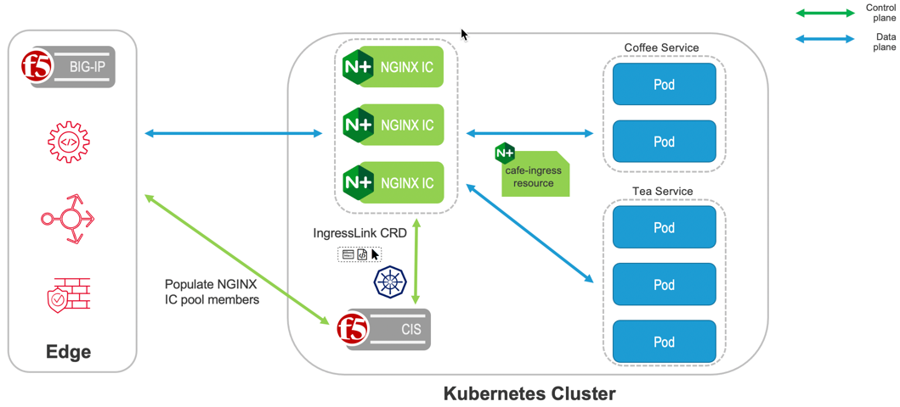

## Kubernetes Ingress API Object

✅ What Ingress Actually Is   
    The Kubernetes Ingress API (networking.k8s.io/v1) is a standard resource that defines rules for routing external HTTP/HTTPS traffic to Services inside the cluster.

    Ingress = Layer 7 (HTTP/HTTPS) routing rule object in Kubernetes   

    It defines:
        - Host-based routing
        - Path-based routing
        - TLS termination
        - Rewrite rules
        - Traffic splitting

        But Ingress itself does NOTHING.

        It requires an Ingress Controller to implement it.

    Example controllers:
        F5 NGINX Ingress Controller
        community nginx ingress
        Traefik
        HAProxy
        AWS ALB controller

✅ Architecture:

        User Request
            |
            v
    +--------------------+
    |   Ingress Object   |  (Routing rules only)
    +--------------------+
            |
            v
    +------------------------------+
    | F5 NGINX Ingress Controller |
    |  (Data plane + Control)     |
    +------------------------------+
            |
            v
    +------------------------------+
    |         Service              |
    +------------------------------+
            |
            v
    +------------------------------+
    |            Pods              |
    +------------------------------+

✅ Important Fields in Ingress
    Example structure: ingress-sample-code.yaml OR below code
```
apiVersion: networking.k8s.io/v1
kind: Ingress
metadata:
  name: demo-ingress
spec:
  ingressClassName: nginx
  rules:
  - host: demo.local
    http:
      paths:
      - path: /
        pathType: Prefix
        backend:
          service:
            name: demo-service
            port:
              number: 80
```
Key parts:

| Field            | Meaning                  |
| ---------------- | ------------------------ |
| ingressClassName | Which ingress controller |
| host             | Domain                   |
| path             | URL path                 |
| backend          | Service to route to      |

✅ F5 NGINX Specific Enhancements
F5 NGINX adds:

    🔹 Annotations
        Example:

            metadata:
                annotations:
                    nginx.org/rewrite-target: /
                    nginx.org/client-max-body-size: 10m

    🔹CRDs
        F5 also provides:
            - VirtualServer
            - VirtualServerRoute
            - TransportServer
            - Policy

        These are more powerful than basic ingress.

✅ F5 NGINX Ingress Controller (also called NGINX Ingress Controller or NIC):
    - it is the production-grade implementation from F5/NGINX that reconciles the K8s standard Ingress objects.
    - It runs as a Deployment (controller pod + NGINX data-plane container), watches Ingress + related resources (Secrets, Services, Endpoints, ConfigMap), validates them, and dynamically generates + reloads an NGINX configuration file to handle routing, load balancing, TLS termination, WebSocket, gRPC, TCP/UDP passthrough, etc.

    🔹 Key F5-specific aspects:
            - Standard Ingress fields are fully supported.

            - Advanced NGINX/NGINX Plus features (rate limiting, JWT auth, WAF, session persistence, rewrites, canary, etc.) are enabled via annotations 
              on the Ingress resource (e.g., nginx.org/rewrite-target, nginx.org/canary, nginx.com/jwt-realm) or a global ConfigMap (for 
              controller-wide settings like proxy timeouts, keepalive, etc.).

            - No heavy reliance on CRDs for basic use (though VirtualServer CRD is available for even more advanced cases in some versions).
            
            - Architecture is classic: one controller pod (or replica set) manages one or more NGINX instances; traffic hits the Service (usually LoadBalancer/NodePort) → NGINX → backend Services.

        In a KIND cluster it works perfectly with NodePort or port-forwarding (no cloud LoadBalancer needed).

💥 Sample example of F5 NGINX Ingress (hands-on compatible with KIND) 
Step 1: 
        Install F5 NGINX Ingress Controller via Helm (recommended; confirm exact OCI path/version from https://docs.nginx.com/nginx-ingress-controller/install/helm/ if needed):

        Helm Command : 
                helm install nginx-ingress oci://ghcr.io/nginx/charts/nginx-ingress \
                --namespace nginx-ingress --create-namespace \
                --set controller.service.type=NodePort 

Step 2: Deploy the sample "cafe" app + Ingress (exact basic example adapted from official F5 docs):
        cafe-app.yaml
        kubectl apply -f cafe-app.yaml

Step 3: Create Ingress resource
        cafe-ingress.yaml
        kubectl apply -f cafe-ingress.yaml

Step 4: Test (port forwarding required in KIND):

        # Find the service name (usually nginx-ingress-nginx-ingress-controller or similar)
        kubectl get svc -n nginx-ingress

        # Port-forward
        kubectl port-forward svc/<service-name> 8081:80 -n nginx-ingress &
        Ex: kubectl port-forward svc/nginx-ingress-controller 8081:80 -n nginx-ingress &

        Then test:
            curl --resolve cafe.example.com:8081:127.0.0.1 http://cafe.example.com:8081/tea1
            curl --resolve cafe.example.com:8081:127.0.0.1 http://cafe.example.com:8081/coffee1

        You will see the NGINX hello pages. 
    Cleanup: kill %1 for port-forward.

    OUTPUT: 
        > curl --resolve cafe.example.com:8081:127.0.0.1 http://cafe.example.com:8081/tea1

            Server address: 192.168.245.16:8080
            Server name: tea-1-64bc69bf78-sqqr9
            Date: 17/Mar/2026:06:32:05 +0000
            URI: /
            Request ID: 63b3c01db5947827174191498a9cea53

        > curl --resolve cafe.example.com:8081:127.0.0.1 http://cafe.example.com:8081/coffee1

            Server address: 192.168.245.15:8080
            Server name: coffee-1-795d94886d-x7hrt
            Date: 17/Mar/2026:06:33:50 +0000
            URI: /
            Request ID: c8d8f6e5d39a2f99352fa0a9eea23b22

        Conclusion :
            👉 This means:
                ✔️ Request routing is working
                    /tea1 → correctly routed to tea-1 service

                ✔️ Rewrite is working
                    /tea1 → rewritten to /

                    - Because rewrite is flattening everything

                ✔️ Backend is responding

        🧠 Why URI shows / instead of /tea1
            Because you configured:

                annotations:
                    nginx.org/rewrite-target: /

            So:
                | Incoming Request | After Rewrite | Backend sees |
                | ---------------- | ------------- | ------------ |
                | `/tea1`          | `/`           | `/` ✅       |

            🔹 “I expected backend to see /tea1” ---> Then you should NOT use rewrite at all
            🔹 Without rewrite
                
                Remove annotation:

                    # remove this
                    # nginx.org/rewrite-target: /

                👉 Result:
                    /tea1  →  /tea1

        🧠 Interview-Level Insight

            If you say:
                “I installed F5 ingress”

            I’ll immediately ask:
                👉 “What image is running?”

            Because:
                Controller identity = container image (> kubectl get deploy -n nginx-ingress -o yaml | grep image)
                NOT YAML, NOT namespace




Rererence link : https://clouddocs.f5.com/containers/latest/userguide/ingresslink/

## Move to 2-gateway-api section