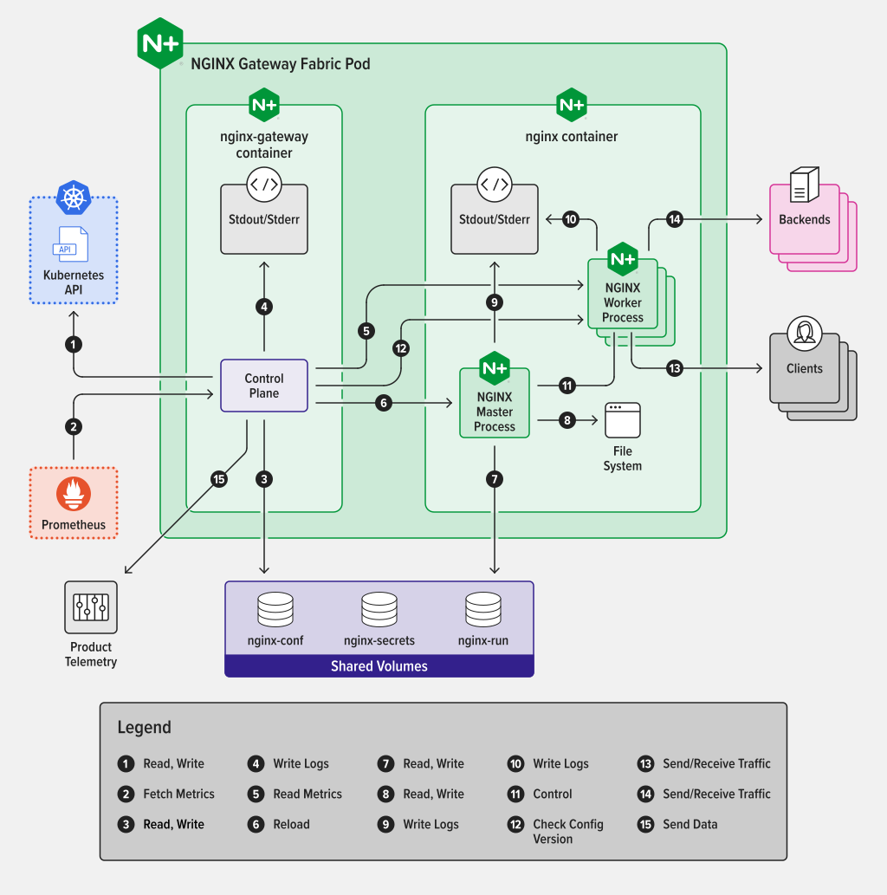
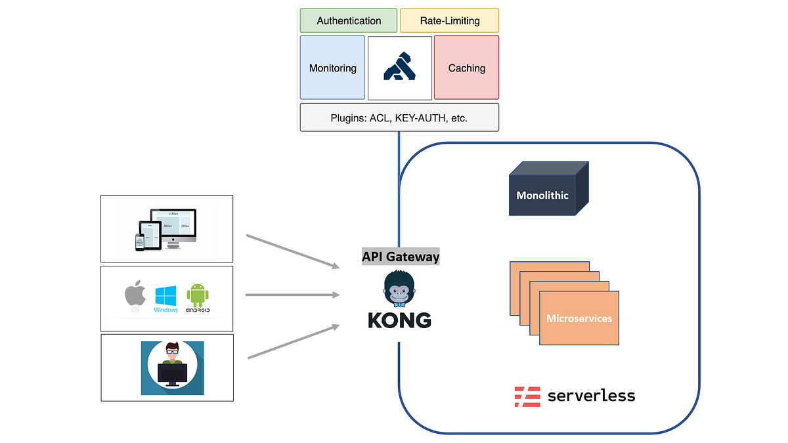
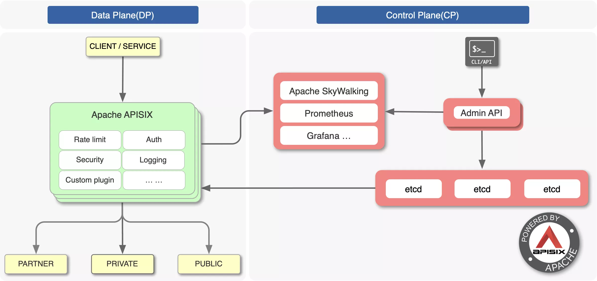
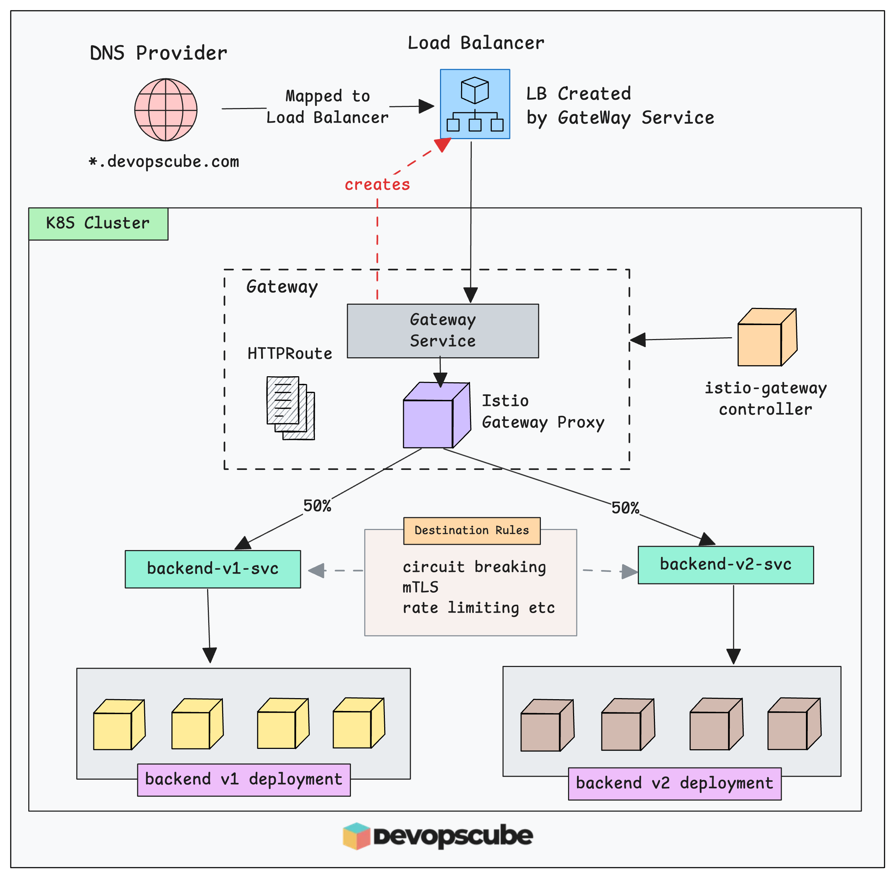
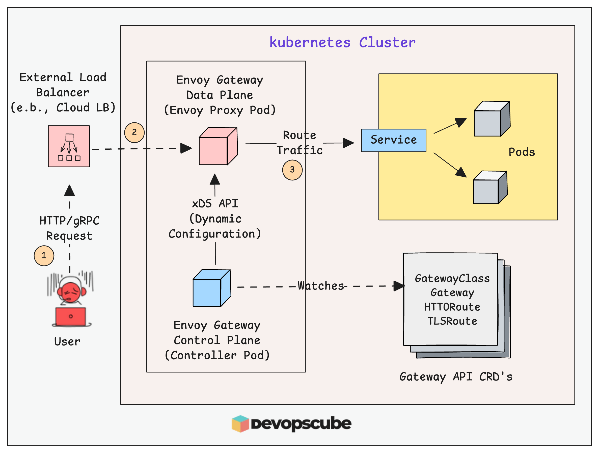

## Gateway API
Gateway API is a CRD-based API in Kubernetes.
we'll use light weight Kubernetes Gateway API --> NGINX Gateway Fabric (NGF) 
- it supports core resources like GatewayClass, Gateway, HTTPRoute, GRPCRoute, TCPRoute, TLSRoute, and UDPRoute.

👉 Built by NGINX
👉 Designed specifically for Gateway API
👉 MUCH lighter than Istio

Some other options of Gateway API:
    we used : NGINX Gateway Fabric

    1. NGINX Gateway Fabric:
        An open-source project from F5 that uses NGINX as the data plane, specifically designed to implement the core Gateway API resources.
        ✅ Use When:
            - You already use NGINX Ingress
            - Need smooth migration from Ingress → Gateway API
            - Want enterprise support
        👍 Strengths:
                - Familiar NGINX behavior
                - Stable and production-ready
                - Good performance
        👎 Weakness:
            Not as dynamic as APISIX/Kong

        
        

    2. Kong Gateway:
        An extensible, plugin-based gateway ideal for API management, authentication, and rate limiting in multi-cloud environments.
        Backed by: Kong Inc.

        ✅ Use When:
            You need API Gateway features:
            - Authentication
            - Rate limiting
            - API monetization
            - Managing public APIs
        
        👍 Strengths:
            -Huge plugin ecosystem
            -Strong API management
            -Works with Gateway API + Ingress

        👎 Weakness:
            - Heavier
            - More operational overhead

        

    3. Apache APISIX
        ✅ Use When:
            - Need high performance + dynamic updates
            - Want real-time config changes (no reload)

        👍 Strengths:
            - Very fast
            - Dynamic (etcd-based)
            - Lightweight compared to Kong

        👎 Weakness:
            Smaller ecosystem than Kong

        

    4. Istio (Gateway API support)
        Backed by: Google / community

        ✅ Use When:
            - You already use Istio service mesh
            - Need north-south + east-west traffic control

        👍 Strengths:
            - Advanced traffic control
            - mTLS, retries, circuit breaking
            - Deep observability

        👎 Weakness:
            - Complex
            - Overkill for simple apps

        

    5. Envoy Gateway
        Backed by: CNCF / Envoy community
        ✅ Use When:
            - You want modern, cloud-native Gateway API-first design
            - Prefer Envoy proxy

        👍 Strengths:
            - Built specifically for Gateway API
            - Clean architecture
            - Future-focused

        👎 Weakness:
            - Still evolving
            - Smaller ecosystem (for now)

        

    6. HAProxy Ingress / Gateway
         ✅ Use When:
            - You need very high performance / low latency
            - Already using HAProxy

        👍 Strengths:
            - Fast and efficient
            - Mature load balancing

        👎 Weakness:
            - Less popular in Gateway API space

    🔥 When to Use Which (Decision Guide)
        🟢 Simple Apps / Learning / KIND
            👉 Use: NGINX Gateway Fabric
                ✔ Easy
                ✔ Familiar
                ✔ Works well locally

        🟡 Enterprise APIs (Auth, Rate Limit, Monetization)
            👉 Use: Kong OR APISIX
                Choose	When
                Kong	Need plugins + ecosystem
                APISIX	Need performance + dynamic config

        🔵 Microservices + Service Mesh
            👉 Use: Istio + Gateway API
                ✔ Internal + external traffic control
                ✔ mTLS
                ✔ advanced routing

        ⚫ Future-proof / Modern Design
            👉 Use: Envoy Gateway
                ✔ Clean architecture
                ✔ Gateway API-first

    ✅ Major Cloud-Managed Implementations:
        🔹 GKE Gateway: Google's implementation that provisions Google Cloud Load Balancers directly for pods in GKE clusters, supporting multi-cluster 
                        load balancing and advanced routing.

        🔹AWS Gateway API Controller: Enables Amazon EKS users to provision VPC Lattice, ALB, and NLB resources using standardized Gateway API resources.
        
        🔹Azure Application Gateway for Containers: A managed Layer 7 load balancing solution for AKS that provides dynamic traffic management via the 
                                                    Gateway API.

    🧠 Reality Check (What Companies Actually Use)
        Let’s be honest (this is where many answers go wrong):
        | Company type | Typical choice      |
        | ------------ | ------------------- |
        | Startups     | ingress-nginx       |
        | Mid-scale    | NGINX / Kong        |
        | API-heavy    | Kong / APISIX       |
        | Large scale  | Istio + Gateway API |
        | GCP shops    | GKE Gateway         |

⚠️ Common Mistakes
    ❌ Mistake 1:
        “Gateway API replaces Service Mesh”

        ✔ Reality:
            - Gateway API = north-south traffic
            - Service Mesh = east-west traffic

    ❌ Mistake 2:
        “All controllers behave the same”

        ✔ Reality:
            Features differ massively (plugins, performance, security)

🎯 Interview-Level Answer (Perfect)

If asked: “Which Gateway API implementation would you choose?”

Answer:
    It depends on use case. For simple ingress replacement I’d use NGINX Gateway Fabric. For API management use Kong or APISIX. If I already run a service mesh like Istio, I’d use its Gateway API integration. For cloud-native setups, I’d prefer managed controllers like GKE Gateway. For future-proof designs, Envoy Gateway is a strong option.

## More Knoledge
✅ Is Gateway API a CRD? 
    Yes.
    Gateway API resources like:
        GatewayClass
        Gateway
        HTTPRoute
        TCPRoute
        TLSRoute

    are all Custom Resource Definitions (CRDs) installed into your cluster.

    👉 Meaning:
        They are not part of core Kubernetes built-in APIs like Pod, Service, Deployment.

✅ Why is Gateway API implemented as CRDs?
    This is the real question — and where most people give a weak answer.
    Core Reason:
        - Because Kubernetes does NOT have built-in advanced traffic management APIs
        - So instead of modifying Kubernetes core (which is slow + risky), they used CRDs.

✅ Deep Reason (What problem it solves)
    ❌ Problem with Ingress:
        Ingress is too limited
        Hard to extend (annotations = messy)
        Controller-specific hacks (NGINX vs Istio vs Kong)
        No standard for L4, L7, traffic splitting, etc.

    ✅ Gateway API Solution:
        | Requirement      | Why CRD helps                                          |
        | ---------------- | ------------------------------------------------------ |
        | Extensible API   | CRDs allow adding new fields without changing k8s core |
        | Vendor-neutral   | Works for NGINX, Istio, Kong, etc                      |
        | Role separation  | Infra team vs App team separation                      |
        | Rich routing     | HTTP, TCP, TLS, traffic splitting                      |
        | Faster evolution | Can release independently of Kubernetes                |

✅ Why NOT built-in API?

    If Gateway API were part of core Kubernetes:

        - Every change → requires Kubernetes release
        - Slower innovation
        - Hard to experiment
        - Breaking changes risk

    👉 CRDs allow:
        - Fast iteration
        - Backward compatibility
        - Optional adoption