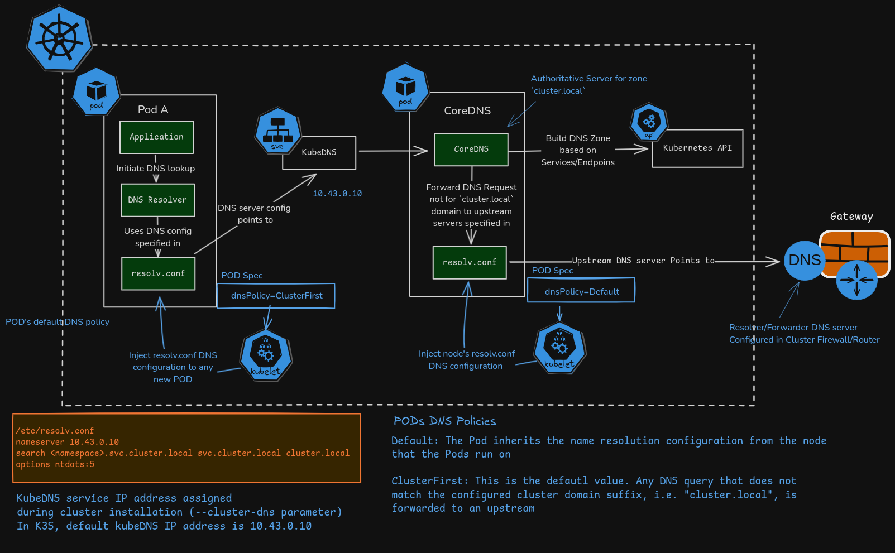

## DNS (Domain Name Service)
DNS in Kubernetes is the system that allows pods and services to find and talk to each other using names instead of hard-coded IP addresses.   
- This is the foundation of service discovery inside the cluster.   
- Since ~Kubernetes 1.13 (2018–2019), the default DNS server is CoreDNS (previously it was kube-dns)   
- In same namespace all pods and services can talk to eachother.

- 🧠 The Problem DNS Solves

    In Kubernetes:
        Pods get random IPs
        When Pods restart → IP changes
        You can’t hardcode IP addresses

    So how does one Pod talk to another?
        👉 Using Service name
        👉 DNS converts that name into an IP   

🏗 Who Handles DNS?

    Kubernetes uses:
    🔹 CoreDNS   
        CoreDNS runs as Pods in: kube-system namespace   
        verify : kubectl get pods -n kube-system | grep coredns   

- Think of Kubernetes DNS like a phonebook inside your cluster.   
Instead of remembering IP addresses, Pods use names.   

Core Components of Kubernetes DNS   

| Component | What it is | Namespace   | Typical ClusterIP |
|:----------|:-----------|:------------|:------------------|
| CoreDNS | The actual DNS server (Deployment) | kube-system | — |
| kube-dns Service | Stable virtual IP pointing to CoreDNS pods | kube-system | usually 10.96.0.10 |
| resolv.conf (in pod) | Configures containers to use cluster DNS   | — | nameserver 10.96.0.10 |   

🧩 Most Important DNS Names (Records Created by CoreDNS)   

| Resource type | DNS Name Pattern | Example (in namespace prod) | Record Type | Resolves to | Short name works when... |
|:--------------|:-----------------|:----------------------------|:------------|:------------|:-------------------------|
| Normal Service | <service>.<namespace>.svc.cluster.local | api.prod.svc.cluster.local | A / AAAA | ClusterIP | same namespace |
| Headless Service | same as above | redis-headless.prod.svc.cluster.local | A (multiple)  | Pod IPs directly | — |
| Pod (with hostname + subdomain) | <pod-name>.<service-name>.<namespace>.svc.cluster.local | web-0.redis-headless.prod.svc.cluster.local | A | Pod IP | StatefulSet usually |
| Pod (generic) | <pod-ip-with-dashes>.<namespace>.pod.cluster.local | 10-244-3-55.prod.pod.cluster.local | A | Pod IP | enabled via pod hostname/subdomain |
| SRV record (named port) | _<port-name>._tcp.<service>.<namespace>.svc.cluster.local  | _http._tcp.api.prod.svc.cluster.local | SRV | port + target | when Service port has name: |

🧠 How DNS Actually Works in Kubernetes (Step by Step)   

    Step 1 : 
        Request Initiation: A Pod attempts to connect to a service (e.g., curl http://my-service).

    Step 2 : 
        Local Configuration: The Pod checks its local /etc/resolv.conf file, which is automatically configured by the Kubelet to point to the CoreDNS Service IP (usually 10.96.0.10).

    Step 3 : 
        Search Domain Expansion: If the name is short (e.g., my-service), the Pod appends search suffixes like .default.svc.cluster.local based on its own namespace.
    
    Step 4 : 
        Query Transmission: The DNS query is sent to the CoreDNS Service.

    Step 5 : CoreDNS Processing:

        a. Internal Check: CoreDNS uses the kubernetes plugin to watch the Kubernetes API for Services and Endpoints.

        b. Match Found: If the name matches an internal Service, CoreDNS returns the Cluster IP.

        c. No Match (External): If the query is for an external domain (e.g., google.com), CoreDNS forwards it to upstream DNS servers defined in the node's configuration.

        When a query reaches CoreDNS, it flows through a chain of plugins defined in the CoreDNS ConfigMap:
            | Plugin | Function |
            |--------|----------|
            | kubernetes | Responds to DNS queries for Kubernetes services/pods.|
            | cache | Caches responses to improve performance for frequent lookups.|
            | forward | Forwards unresolved queries to upstream nameservers.|
            | errors/health | Logs errors and provides health check endpoints for the cluster.|


    Step 6 : 
        Response: CoreDNS sends the resolved IP back to the requesting Pod, which then initiates the network connection.

    🚀 Simple Summary
        DNS in Kubernetes:
            1. Pod sends DNS query
            2. CoreDNS checks Services
            3. Returns Service IP
            4. kube-proxy routes traffic to Pod
        That’s it.   
        
🚢 How does the magic short name work?
    When Kubernetes creates a pod, it secretly writes three rules inside the pod:

    I can talk to services using these name endings (in this order):
        1. .default.svc.cluster.local          ← my own namespace
        2. .svc.cluster.local                  ← any namespace
        3. .cluster.local                      ← very rare special things

    So when your app says : curl http://my-service
    the pod thinks:
        Is there something called my-service.default.svc.cluster.local? → yes → talk to it
        (it never reaches the other two lines)

        That’s why my-service works inside the same namespace.   

⚙️ Very simple picture of what happens:   
```
Your app inside pod          →   says:   my-service:8080
          ↓
Linux inside the pod         →   looks at /etc/resolv.conf (sees:   search default.svc.cluster.local)
          ↓
adds the missing part        →   my-service → my-service.default.svc.cluster.local
          ↓
asks CoreDNS (the DNS guy)   →   "what is my-service.default.svc.cluster.local?"
          ↓
CoreDNS asks Kubernetes      →   "which pods are behind service my-service?"
          ↓
Kubernetes answers           →   "here is the IP 10.96.42.17"
          ↓
CoreDNS tells the pod        →   "use 10.96.42.17"
          ↓
your curl reaches the right pod
```

🎯 Important Beginner Concepts
    ✅ DNS is only for Services (by default)

        You cannot directly call: pod-name
        Unless you use a Headless Service.

    ✅ Service IP does NOT change
        Pods may restart and change IP.
        But Service IP remains stable.
        DNS always points to Service — not directly to Pods.
## Core DNS architecture
