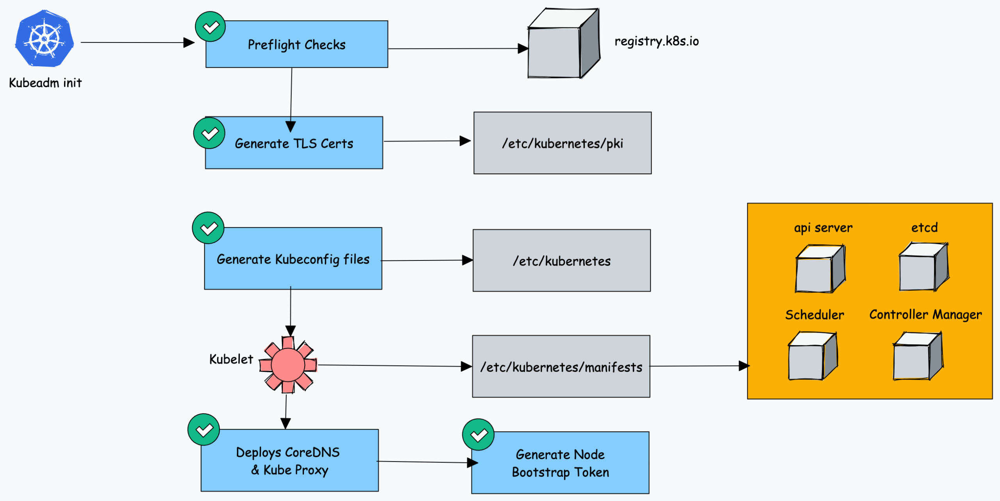

⭐ Drain    : Remove all he running pods from the node (evicting the pods/workloads).   
⭐ Cordon   : mark node as unschedulable (not availabe for pods/workloads).  
⭐ Uncordon : mark node as schedulable (Availabe for pods/workloads).

## how to upgrade AWS k8s cluster ?
In AWS Kubernetes (Amazon EKS), cluster upgrades happen in two separate parts:

    1️⃣ Control Plane Upgrade (AWS manages it)
    2️⃣ Worker Node Upgrade (you manage it)

    Understanding this separation is important.

✅ EKS Architecture
    AWS Managed
    ------------
    API Server
    Scheduler
    Controller Manager
    etcd

    Customer Managed
    ----------------
    Worker Nodes (EC2)
    Pods

    AWS upgrades control plane, but you must upgrade worker nodes.

✅ Step-by-Step EKS Upgrade Process
    Step 1 — Check Available Versions
        aws eks describe-cluster \
        --name my-cluster \
        --query "cluster.version"

        Check available upgrades:
            aws eks describe-addon-versions

        OR 
        
        via console.

    Step 2 — Upgrade Control Plane
        Upgrade cluster version:
            aws eks update-cluster-version \
            --name my-cluster \
            --kubernetes-version 1.29
                    
        What AWS does internally:

            Create new control plane
                    ↓
            Migrate etcd state
                    ↓
            Switch API server endpoint
                    ↓
            Delete old control plane

        Important:
            No downtime
            Rolling replacement

    Step 3 — Upgrade Managed Node Groups
        Worker nodes must match the control plane version (±1 version allowed).

        Upgrade node group:
            aws eks update-nodegroup-version \
            --cluster-name my-cluster \
            --nodegroup-name my-nodegroup
        
        AWS performs rolling node replacement.
        Process:
            Create new node
                ↓
            Join cluster
                ↓
            Drain old node
                ↓
            Move pods
                ↓
            Terminate old node

    Step 4 — Upgrade EKS Addons
        Important addons must match the cluster version.
        Typical addons:
            | Addon      | Purpose          |
            | ---------- | ---------------- |
            | VPC CNI    | Pod networking   |
            | CoreDNS    | DNS              |
            | kube-proxy | Networking rules |
            | EBS CSI    | Storage          |

        Upgrade example:
            aws eks update-addon \
            --cluster-name my-cluster \
            --addon-name vpc-cni \
            --resolve-conflicts OVERWRITE

✅ Real Production Upgrade Flow
    Production teams usually follow this order:
    1️⃣ Upgrade Control Plane
    2️⃣ Upgrade Addons
    3️⃣ Upgrade Node Groups
    4️⃣ Verify workloads

✅ Example Timeline:

    Cluster version: 1.27
    Target version: 1.28

    Step 1
        Upgrade control plane → 1.28

    Step 2
        Upgrade CoreDNS
        Upgrade kube-proxy
        Upgrade VPC CNI

    Step 3
        Upgrade node groups

    Step 4
        Verify workloads

✅ Important Rules (EKS upgrade rules):
| Rule                  | Description                                 |
| --------------------- | ------------------------------------------- |
| Sequential upgrade    | Cannot skip versions                        |
| Nodes ≤ control plane | Nodes must not exceed control plane version |
| Supported skew (skew policy) | Nodes can be **1 version behind**           |

Example:
    Control plane: 1.29
    Nodes allowed: 1.29 or 1.28

✅ Zero-Downtime Mechanism
    EKS achieves zero downtime using:
        Rolling node replacement
        PodDisruptionBudgets
        Graceful node drain

    Example:
        Old node
            ↓
        kubectl drain
            ↓
        Pods move to new node

✅ Production Best Practice
    Most teams use tools like:

    | Tool      | Purpose                   |
    | --------- | ------------------------- |
    | eksctl    | Manage EKS clusters       |
    | Terraform | Infrastructure automation |
    | ArgoCD    | App redeployment          |
    | Karpenter | Node lifecycle            |

    Example with eksctl: 
        eksctl upgrade cluster \
        --name my-cluster \
        --version 1.29

⭐ Short Answer : 
    In Amazon EKS, cluster upgrades involve first upgrading the AWS-managed control plane, then upgrading worker nodes and addons using rolling updates to ensure zero downtime.

## how to upgrade on-prem k8s cluster ?
Upgrading an on-prem Kubernetes cluster (typically created with kubeadm) is a manual rolling upgrade.
You must upgrade components in a specific order to keep the cluster stable.

Upgrade order:
    1️⃣ Control Plane
    2️⃣ kubeadm
    3️⃣ kubelet + kubectl
    4️⃣ Worker Nodes

Important rule:
    Control plane version ≥ kubelet version
    Nodes can be one version behind.

✅ Example Scenario
    Current version: v1.28
    Target version: v1.29

    Step 1 — Check Current Version
        
        > kubectl version --short

        Check cluster nodes: kubectl get nodes

    Step 2 — Upgrade kubeadm (Control Plane Node)
        On the control plane node:
        Update repo and install new kubeadm.

        Example (Ubuntu):
            sudo apt update
            sudo apt install kubeadm=1.29.0-00

        Verify:
            kubeadm version

    Step 3 — Plan Upgrade
        Check upgrade plan: sudo kubeadm upgrade plan

        Example output: Upgrade to v1.29.0 available

        This command checks:
            API compatibility
            addon versions
            etcd compatibility

    Step 4 — Upgrade Control Plane
        Run: sudo kubeadm upgrade apply v1.29.0

        What happens internally:
            Upgrade API server
            Upgrade controller manager
            Upgrade scheduler
            Upgrade etcd
            Update cluster certificates

    Step 5 — Upgrade kubelet + kubectl
        After control plane upgrade:
            sudo apt install kubelet=1.29.0-00 kubectl=1.29.0-00

        Restart kubelet:
            sudo systemctl daemon-reexec
            sudo systemctl restart kubelet

    Step 6 — Upgrade Worker Nodes
        For each worker node. Drain the node.
        > kubectl drain <node-name> --ignore-daemonsets

        Upgrade kubeadm:
            sudo apt install kubeadm=1.29.0-00

        Upgrade node:
            sudo kubeadm upgrade node

        Upgrade kubelet:
            sudo apt install kubelet=1.29.0-00 kubectl=1.29.0-00

        Restart kubelet:
            sudo systemctl restart kubelet

        Uncordon node:
            kubectl uncordon <node-name>

✅ Rolling Upgrade Example
For 3 worker nodes:
    node1 → drain → upgrade → uncordon
    node2 → drain → upgrade → uncordon
    node3 → drain → upgrade → uncordon

    Pods move automatically.

✅ Verify Upgrade
    Check nodes: kubectl get nodes

    Example: 
        node1   Ready   v1.29.0
        node2   Ready   v1.29.0
        node3   Ready   v1.29.0

✅ Upgrade Addons (Important)
    Common addons:
        | Addon                | Purpose        |
        | -------------------- | -------------- |
        | CoreDNS              | DNS            |
        | kube-proxy           | networking     |
        | CNI (Calico/Flannel) | pod networking |

    Example: kubectl -n kube-system get pods

    If using Calico, upgrade it separately.

✅ Zero-Downtime Strategy
Production clusters use:
    PodDisruptionBudgets
    Rolling node upgrades
    Multiple replicas

⭐ Short Answer
    On-prem Kubernetes clusters are upgraded using kubeadm by first upgrading the control plane components, then upgrading kubelet and kubectl, followed by draining and upgrading worker nodes one by one to ensure a rolling upgrade without downtime.

## kubeadm init flow
 