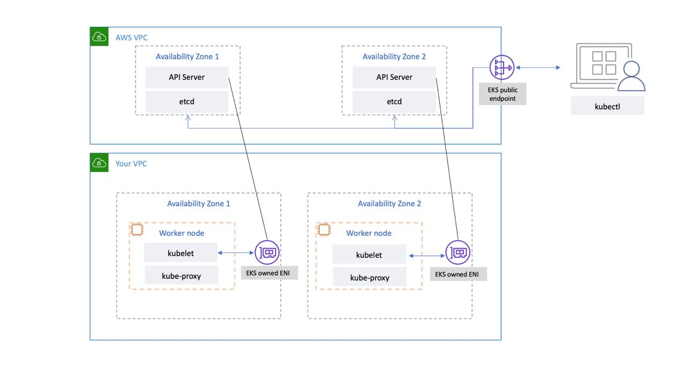
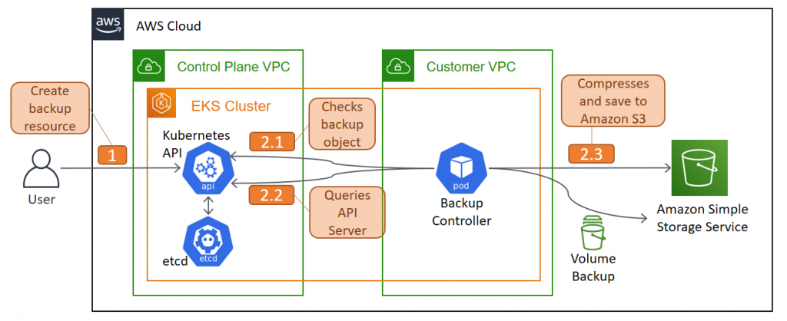

## etcd Backup steps in AWS EKS k8s cluster   
In Amazon Elastic Kubernetes Service (EKS) you cannot directly take etcd backup like you do in kubeadm/on-prem clusters.   
    Reason: etcd is managed by AWS control plane and AWS does not give SSH access to control-plane nodes.   
So the actual etcd snapshot command (etcdctl snapshot save) cannot be executed in EKS.   
Instead, backup strategies in EKS focus on Kubernetes resources and persistent data, not etcd directly.   

✅ Why etcd backup is not possible in EKS   
    Architecture of EKS:   
         

    Control Plane (Managed by AWS)
        - API Server
        - Scheduler
        - Controller Manager
        - etcd database

    You only manage:
        - Worker nodes
        - Kubernetes resources

    Therefore:
        ❌ Cannot SSH to control plane
        ❌ Cannot run etcdctl
        ❌ Cannot access /var/lib/etcd

    AWS internally handles:
        etcd replication
        snapshots
        disaster recovery

✅ What you should backup in EKS instead
    For disaster recovery, backup the below:
    | Backup Type           | Tool                   |
    | --------------------- | ---------------------- |
    | Kubernetes objects    | Velero                 |
    | Persistent volumes    | Velero / EBS snapshots |
    | Cluster configuration | GitOps / YAML          |
    | Databases             | DB backups             |

✅ Best Practice: Backup using Velero
    Most common solution, Velero backs up:
        deployments
        services
        configmaps
        secrets
        CRDs
        PVC metadata
        volume snapshots
        Velero stores backup in S3.

    Step 1 — Create S3 bucket
            aws s3 mb s3://eks-backup-bucket

    Step 2 — Create IAM Role for Velero
            Attach policy for:
                S3 access
                EBS snapshots

            Example permissions:
                AmazonS3FullAccess
                AmazonEBSFullAccess

    Step 3 — Install Velero CLI
            wget https://github.com/vmware-tanzu/velero/releases/latest/download/velero-linux-amd64.tar.gz
            tar -xvf velero-linux-amd64.tar.gz
            sudo mv velero /usr/local/bin/

    Step 4 — Install Velero in cluster
            velero install \
            --provider aws \
            --plugins velero/velero-plugin-for-aws:v1.7.0 \
            --bucket eks-backup-bucket \
            --backup-location-config region=ap-south-1 \
            --snapshot-location-config region=ap-south-1

    Step 5 — Take backup
            velero backup create eks-cluster-backup

            Check backups:
                velero backup get

    Step 6 — Restore cluster
            velero restore create --from-backup eks-cluster-backup

✅ EKS Backup Architecture
     

    Flow:
        Kubernetes Cluster
            │
            │ Velero Backup
            ▼
        Object Storage (AWS S3)
            │
            ▼
        Restore to new cluster

⭐ How to backup etcd in EKS ?
    In AWS EKS, etcd runs in the AWS-managed control plane, so we cannot access it directly to take snapshots. AWS automatically manages etcd backups and high availability. For disaster recovery, we use tools like Velero to back up Kubernetes resources and persistent volumes to S3.

✅ Comparison: On-Prem vs EKS etcd backup
| Feature           | kubeadm / On-prem       | EKS         |
| ----------------- | ----------------------- | ----------- |
| etcd access       | Yes                     | No          |
| SSH control plane | Yes                     | No          |
| etcd snapshot     | `etcdctl snapshot save` | Not allowed |
| Backup method     | etcd snapshot           | Velero / S3 |
| Managed by        | Admin                   | AWS         |

✅ Simple memory trick for interviews
    On-Prem Kubernetes → Backup ETCD
    EKS / AKS / GKE → Backup Kubernetes resources