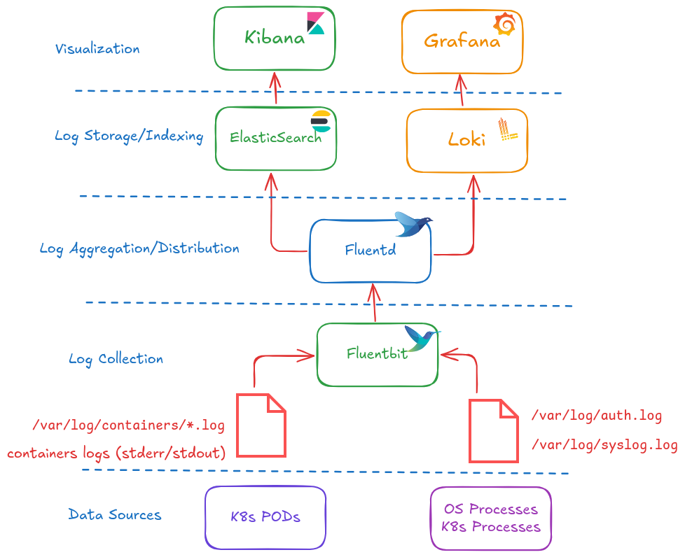

## setup to enable logging in KIND (Fluent Bit + Loki + Grafana)
Here is a realistic, lightweight, and copy-paste friendly setup for Fluent Bit + Grafana Loki + Grafana on a local Kind cluster (as of March 2026). This uses the monolithic/single-binary mode for Loki (perfect for Kind/local dev — low memory ~150–400 MB total stack).   

🧩 Prerequisites
    🔹Kind cluster already running (kind create cluster)
    🔹Helm 3+ installed
    🔹kubectl configured to point to Kind

Step 1 — Add Helm repositories
        helm repo add grafana https://grafana.github.io/helm-charts
        helm repo add fluent    https://fluent.github.io/helm-charts
        helm repo update

Step 2 — Create namespace (optional but clean)
        kubectl create namespace observability

Step 3 — Install Loki in monolithic mode (recommended for Kind)
        Create a file loki-values.yaml with this minimal local-friendly config
        helm upgrade --install loki grafana/loki \
        --namespace observability \
        --values loki-values.yaml

        After Successful Install
            Verify the pod: > kubectl get pods -n observability | grep loki
            Wait until all pods are ready

Step 4 — Install Fluent Bit (configured to send to Loki)
        Create fluent-bit-values.yaml
        Install/upgrade:
            helm upgrade --install fluent-bit fluent/fluent-bit \
            --namespace observability \
            --values fluent-bit-values.yaml

Step 5 — Install Grafana (with Loki datasource pre-configured)
        Create grafana-values.yaml
        Install:
            helm upgrade --install grafana grafana/grafana \
            --namespace observability \
            --values grafana-values.yaml

Step 6 — Access Grafana & Explore Logs
        1. Get the Grafana service NodePort (or just use the one above):
            kubectl get svc grafana -n observability

            Access Grafana(in new tab) : kubectl port-forward svc/grafana -n observability 3000:3000

            Open:
                http://localhost:3000

            Login with:
                admin / admin123

💥 Quick Troubleshooting Commands

    🔹 Fluent Bit logs: kubectl logs -n observability -l app.kubernetes.io/name=fluent-bit -f
    🔹 Loki ready?: kubectl logs -n observability -l app.kubernetes.io/name=loki -f
    🔹 Check Fluent Bit → Loki connection: look for 200/204 responses in Fluent Bit logs
    🔹 Port-forward Loki (if needed): kubectl port-forward svc/loki 3100:3100 -n observability

👉 OPTIONAL - Generate some fresh test logs (to make sure ingestion happens in real-time)

    # Run this a few times or in a loop
    > kubectl exec -it nginx -- sh -c 'echo "SUCCESS: This should appear in Loki - $(date)" >&1; echo "ERROR: Test error log $(date)" >&2; sleep 2'

👉 Check in Grafana (Loki datasource):
    Go to Explore → Select Loki datasource
    Use one of these LogQL queries (start simple):text
        {namespace_name="default"}
                    OR
        {container_name="nginx"}

👉 Broader queries to confirm volume
    {job="fluentbit"}               # Fluent Bit's own logs (if self-logging)
    {namespace_name=~".+"}          # Any namespace
    {pod_name=~"app.*"}             # Your app1/app2 pods

🧠 Summary – Your Stack Status
    Kind cluster → Containers producing logs to stdout/stderr
    Fluent Bit (DaemonSet) → Tailing /var/log/containers/*.log, enriching with k8s metadata, sending to Loki
    Loki (SingleBinary, filesystem storage) → Receiving and storing logs
    Grafana → Querying Loki and displaying logs

If logs show up in Grafana → congratulations, your local logging + monitoring setup (Fluent Bit + Loki + Grafana) is complete!

## fluentbit and fluentd
 