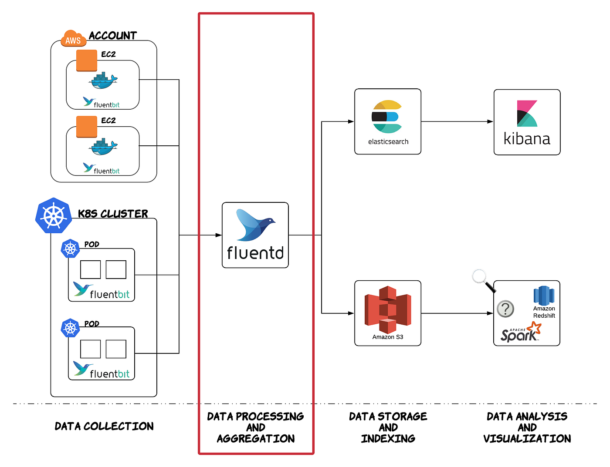

## Logging and Monitoring
Logging and monitoring in Kubernetes are core parts of observability — helping you understand what is happening inside your cluster (past events via logs, current state via metrics, and request flows via traces).   

In 2025–2026 the dominant approach is OpenTelemetry (OTel) as the unified way to collect logs + metrics + traces, very often combined with eBPF for deep, low-overhead visibility.

## Logging
✅ What is Logging?

    Logging means collecting and storing application/system logs from containers and cluster components.
    Kubernetes itself does not store logs centrally — it only makes sure container logs are available short-term on the node.

    Logs help answer:
        Why did the pod crash?
        What error occurred?
        What request was processed?

    Example container log:
        kubectl logs nginx-pod

    Example output:
        2026-03-12 10:12:01 INFO Server started
        2026-03-12 10:12:10 ERROR Database connection failed

✅ How Logging Works in Kubernetes

    1. Applications write logs to stdout/stderr
    2. Container runtime (containerd/docker) stores logs on node
    3. Log agent collects logs (Ex: Fluent Bit or Fluentd)
    4. Logs sent to centralized system

    Flow:
        Application Container
                │
                ▼
        stdout / stderr
                │
                ▼
        Container Runtime Logs
        (/var/log/containers)
                │
                ▼
        Log Agent (Fluentd / Fluent Bit)
                │
                ▼
        Central Storage (Elasticsearch / Loki)
                │
                ▼
        Visualization (Kibana / Grafana)

✅ Types of Logs:
    1️⃣ Application Logs: Produced by your code.

    2️⃣ System Component Logs: From the API server, scheduler, and kubelet.

    3️⃣ Audit Logs: A record of every call made to the Kubernetes API for security and compliance. 

✅ Where the Log Collector Runs
I   n Kubernetes, log collectors typically run in one of two ways: 
    🔹 DaemonSet (Most Common): One instance of the collector runs on every node in the cluster. It mounts the node’s log directory (usually /var/log/
        pods) to read all container logs at once.

    🔹 Sidecar: A collector container is added directly to a specific application pod. This is used for applications that don't write to stdout (e.g., 
        they write to a custom file on a volume). 

✅ Popular Kubernetes Logging Stack
    1. EFK Stack
        Elasticsearch → stores logs
        Fluentd → collects logs
        Kibana → visualize logs

        Pod Logs → Fluentd → Elasticsearch → Kibana

    2. Loki Stack (Modern and Lightweight)
        Pod Logs → Promtail → Loki → Grafana

        Advantages:
            cheaper than Elasticsearch
            optimized for Kubernetes

✅ Where Logs Exist in Node

    On each node:
        /var/log/containers/
        /var/log/pods/

    Example:
        /var/log/containers/nginx-pod_default_nginx-123.log

## Monitoring
Monitoring means collecting metrics about cluster health and performance to show the ongoing behavior of the system.

Example metrics:
    CPU usage
    Memory usage
    Pod restart count
    Node status
    Network traffic

✅ Key Monitoring Layers
🔹Cluster Level: Overall health and resource capacity (e.g., via Metrics Server).

🔹Node Level: Hardware health, disk I/O, and network pressure (e.g., via Node Exporter).

🔹Pod/Container Level: Resource usage per app and restart counts (e.g., via cAdvisor).

✅ Monitoring Architecture

    Node / Pod Metrics
            │
            ▼
    Exporters (node-exporter, kube-state-metrics)
            │
            ▼
    Prometheus
            │
            ▼
    Alertmanager
            │
            ▼
    Grafana Dashboard

✅ Popular Monitoring Stack
    Prometheus + Grafana

⭐ Logging in Kubernetes collects logs from containers and cluster components and stores them in centralized systems like ELK or Loki for troubleshooting.

⭐ Monitoring collects cluster and application metrics like CPU, memory, and pod health using tools like Prometheus and Grafana to track system performance and trigger alerts.

✅ Logging vs Monitoring
| Feature       | Logging                       | Monitoring                            |
| ------------- | ----------------------------- | ------------------------------------- |
| Purpose       | Debug issues                  | Track performance                     |
| Data type     | Text logs                     | Numeric metrics                       |
| Example       | Error logs                    | CPU usage                             |
| Tools         | Fluent Bit + Loki/ClickHouse  | Prometheus + Grafana / OTel + Grafana |
| Visualization | Kibana                        | Grafana                               |
| Volume        | Very high (GB/day common)     | Much lower                            |
| Storage       | Log index/search engine       | Time-series DB                        |

✅ Complete Observability Stack (Most Common)
                Kubernetes Cluster
                        │
        ┌───────────────┴───────────────┐
        │                               │
     Logs                            Metrics
        │                               │
  Fluent Bit / Promtail          Node Exporter
        │                               │
        ▼                               ▼
     Loki / Elasticsearch          Prometheus
        │                               │
        └───────────────┬───────────────┘
                        ▼
                      Grafana

⭐ Tips for DevOps Interviews

🔹Where Fluent Bit reads logs from?
    Answer:
        /var/log/containers
        /var/log/pods

🔹Why DaemonSet is used?
    Answer:
        To run one log collector per node.

🧠 More information of Logging and Monitoring 

    - logging and monitoring tools are separate systems because they handle different data types.
        Monitoring → metrics (numbers over time)
        Logging → text events from applications/systems

    - This separation exists because metrics need fast time-series databases, while logs need search/aggregation systems.

    Both are used together for observability.

    Example:
        Monitoring → CPU usage spike
        Logging → shows the error causing the spike

✅ Most Common Logging + Monitoring Tool Combinations
    1️⃣ Prometheus + Grafana + Loki + Fluent Bit (Very Popular)
        🔹Monitoring
            Prometheus
            Grafana

        🔹Logging
            Fluent Bit
            Loki

        Flow : 
            Metrics → Prometheus → Grafana
            Logs → Fluent Bit → Loki → Grafana

    2️⃣ Prometheus + Grafana + EFK Stack
        🔹Monitoring:
            Prometheus
            Grafana

        🔹 Logging tools:
                Fluentd
                Elasticsearch
                Kibana

        Flow :
            Logs → Fluentd → Elasticsearch → Kibana
            Metrics → Prometheus → Grafana

    3️⃣ Datadog (All-in-One Platform)
        Monitoring + Logging together.

        🔹Tools
            Datadog agent
            Datadog dashboards

        Flow :
            Logs + Metrics → Datadog Agent → Datadog Cloud
        
✅ Most Common Kubernetes Stack (Industry)

| Layer             | Tool       |
| ----------------- | ---------- |
| Metrics           | Prometheus |
| Dashboard         | Grafana    |
| Log Collector     | Fluent Bit |
| Log Storage       | Loki       |
| Log Visualization | Grafana    |

⭐ Monitoring tools like Prometheus store time-series metrics and are optimized for performance and alerting, while logging systems like Elasticsearch or Loki store large volumes of text logs and provide powerful search and analysis capabilities. Therefore both systems are used together for complete observability.

## Logging and Monitoring
 

## Extra Info
Q : Loki, Grafana Loki, Grafana are same ?

Ans : 
    Grafana and Grafana Loki (often just called Loki) are not the same, but they are designed to work together as part of the same observability stack

    - Grafana is the dashboarding and visualization platform.
    - Grafana Loki is the log aggregation system that stores logs and feeds them to Grafana.

    Key Differences:
        - Grafana: Visualizes metrics, logs, and traces.

        - Loki: A horizontally scalable, highly available, log aggregation system inspired by Prometheus.

        - Relationship: You use Grafana to query and visualize the logs stored in Loki.

✅ My suggestion for learning roadmap (DevOps interviews too):

    1️⃣ Metrics → Prometheus + Grafana
    2️⃣ Logs → Fluent Bit + Loki
    3️⃣ Tracing → Jaeger / Tempo

    Example Architecture for KIND:
                 KIND Cluster
                    │
            ┌───────┴────────┐
            │                │
        Pod logs        Pod logs
            │                │
            └───────┬────────┘
                    ▼
                Fluent Bit
                    │
                    ▼
                    Loki
                    │
                    ▼
                Grafana

